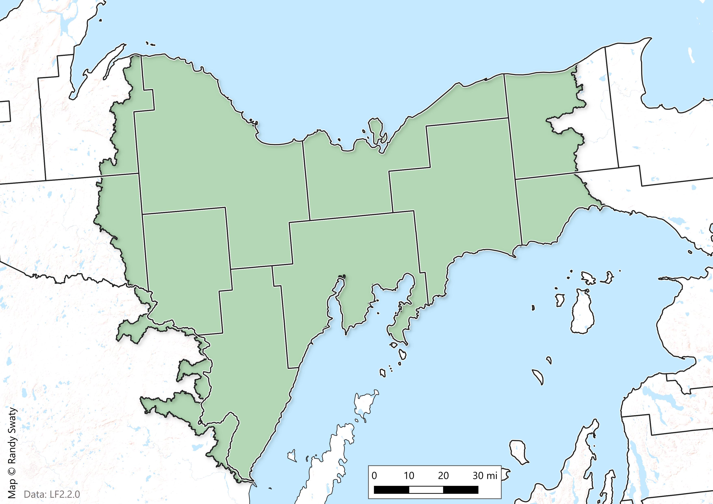
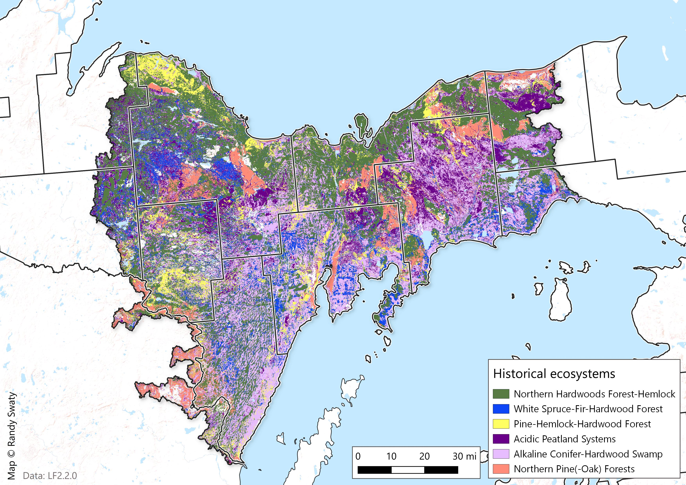
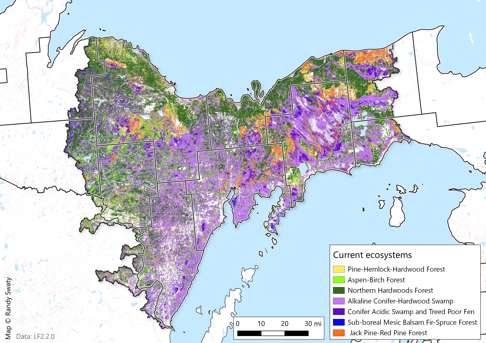
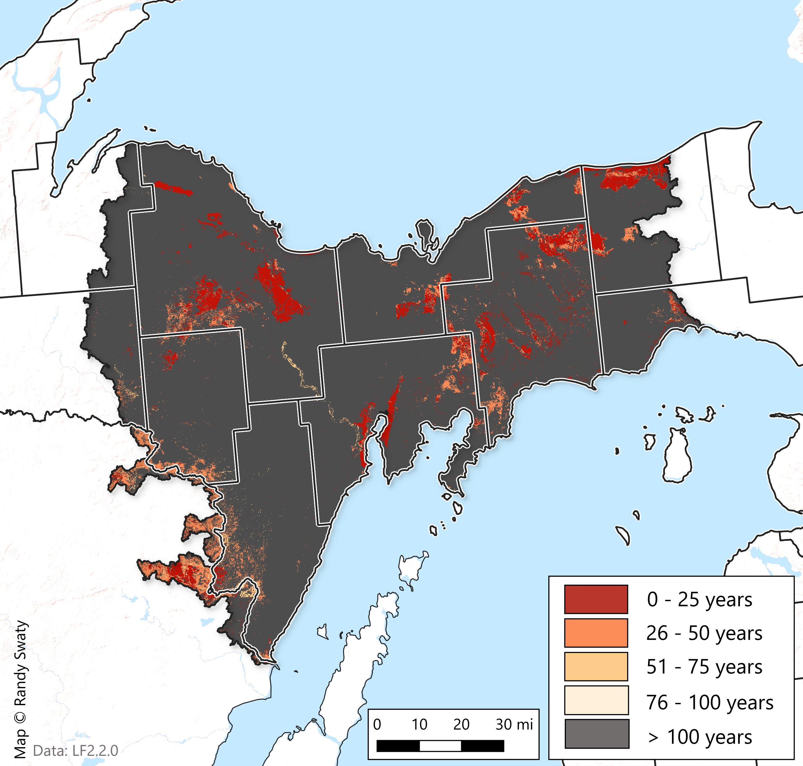

```{r setup, include=FALSE}
library(flexdashboard)
library(chorddiag)
library(htmlwidgets)
library(igraph)
library(readr)
library(tidygraph)
library(tidyverse)
chord_df <- read_csv("data/bps2evt_chord.csv")
```

Home
==================

Column {data-width = 150}
-----------------------------------------------------------------------

### Map of the Central Upper Peninsula Assessment Area

```{r}

```

Column {data-width = 150}
-----------------------------------------------------------------------

### Description

##### Introduction to the project. What we're doing, what the objectives are, etc.

Past and Present
==================

Column {data-width = 150}
-----------------------------------------------------------------------

### Map of PreEuropean-Settlement Ecosystems

```{r}

```

### discuss the figure

##### discussion

Row {data-width = 550}
-----------------------------------------------------------------------

### Map of Current Ecosystems

```{r}

```

### discuss the figure

##### discussion

Row {data-width = 550}
-----------------------------------------------------------------------

### Past -> Present: Ecosystem Makeup

```{r chordDiagram, fig.height = 6.5, fig.width = 8}
matrix_df <-as.matrix(as_adjacency_matrix(as_tbl_graph(chord_df),attr = "ACRES"))

#clean up matrix (could be cleaner!)
matrix_df = subset(matrix_df, select = -c(1:6))

matrix_df <- matrix_df[-c(7:15),]

# make a custom color pallet-you may have to adjust this if some categories are missing! 

# ORIGINAL
groupColors <-c( "#1B5E20", # forest green for conifer
                 "#D17B0F", # earthy orange for grassland
                 "#689F38", # deep green for hardwood
                 "#4C8C4A", # moss green for hardwood-conifer
                 "#4FC3F7", # sky blue for riparian
                 "#FF6F00", # amber for shrubland
                 "#FBC02D", # yellow for agriculture
                 "#1B5E2E", # conifer
                 "#795548", # brown for developed areas
                 "#E91E63", # magenta for exotics
                 "#D17B0F", # grassland
                 "#689F30", # hardwood
                 "#4FC3F7", # riparian
                 "#FF6F00"  # shrubland
)

#make chord diagram
chord <- chorddiag(data = matrix_df,
                 type = "bipartite",
                 groupColors = groupColors,
                 groupnamePadding = 10,
                 groupPadding = 3,
                 groupnameFontsize = 12 ,
                 showTicks = FALSE,
                 margin=130,
                 tooltipGroupConnector = "    &#x25B6;    ",
                 chordedgeColor = "#363533"
)

chord 
```

Late Succession
==================

Column {data-width = 350}
-----------------------------------------------------------------------

### Biophysical Settings

```{r bps, fig.height = 5, fig.width = 10}
bps_colors <- c(
  "#556B2F", # Dark olive green, deep and rich
  "#8B4513", # Saddle brown, like tree bark
  "#6B8E23", # Olive drab, typical of leafy canopies
  "#228B22", # Forest green, classic and deep
  "#DEB887", # Burlywood, light and earthy
  "#A0522D", # Sienna, a reddish-brown earth tone
  "#B8860B", # Dark goldenrod, rich and warm
  "#CD853F", # Peru, a soft and earthy orange
  "#808000", # Olive, muted and natural
  "#3CB371"  # Medium sea green, refreshing and vibrant
)

bps_data <- read.csv("data/bps_aoi_attributes.csv")

# wrangle data
bpsname <- bps_data %>%
  group_by(BPS_NAME) %>%
  summarize(ACRES = sum(ACRES),
            REL_PERCENT = sum(REL_PERCENT)) %>%
  arrange(desc(REL_PERCENT)) %>%
  top_n(n = 10, wt = REL_PERCENT)

# plot historical (bps)data
bpsChart <- 
  ggplot(data = bpsname, aes(x = BPS_NAME, y = REL_PERCENT, fill = BPS_NAME)) +
  geom_bar(stat = "identity") +
  scale_fill_manual(values = bps_colors) +
  labs(
    title = "Top 10 Biophysical Settings",
    caption = "Data from landfire.gov; Chart © Randy Swaty",
    x = "",
    y = "Percent of Landscape") +
  scale_x_discrete(limits = rev(bpsname$BPS_NAME),
                   labels = function(x) str_wrap(x, width = 18)) +
  coord_flip() +
  theme_bw(base_size = 10)  +
  theme(legend.position = "none")

bpsChart
```

Column {data-width = 350}
-----------------------------------------------------------------------

### Existing Vegetation Types

```{r evt, fig.height = 5, fig.width = 10}
evt_colors <- c(
  "#A8B6A6", # Sage green, reminiscent of soft foliage
  "#D2B48C", # Tan, like dry grass or sand
  "#CAB2D6", # Heather purple, muted and subtle
  "#E9967A", # Dark salmon, like sunset skies
  "#A3C1AD", # A more muted teal, like calm water
  "#F4A460", # Sandy brown, warm and earthy
  "#8FBC8F", # Sea green, soft and natural
  "#FFDAB9", # Peach, light and delicate
  "#BC8F8F", # Rosy brown, soft and warm
  "#DDA0DD"  # Pale violet, like early spring flowers
)

evtname <- read.csv(file = "data/evt_aoi_attributes.csv") %>%
  group_by(EVT_NAME) %>%
  summarize(ACRES = sum(ACRES),
            REL_PERCENT = sum(REL_PERCENT)) %>%
  arrange(desc(REL_PERCENT)) %>%
  top_n(n = 10, wt = REL_PERCENT)

# plot
evtChart <-
  ggplot(data = evtname, aes(x = EVT_NAME, y = REL_PERCENT, fill = EVT_NAME)) +
  geom_bar(stat = "identity") +
  scale_fill_manual(values = colors) +
  labs(
    title = "Top 10 Existing Vegetation Types",
    caption = "Data from landfire.gov; Chart © Randy Swaty",
    x = "",
    y = "Percent of Landscape") +
  scale_x_discrete(limits = rev(evtname$EVT_NAME),
                   labels = function(x) str_wrap(x, width = 18)) +
  coord_flip() +
  theme_bw(base_size = 10) +
  scale_fill_manual(values = evt_colors) +
  theme(legend.position = "none")

evtChart
```


Wildfire
==================

### Historical Fire Regime

```{r}

```

About
==================

